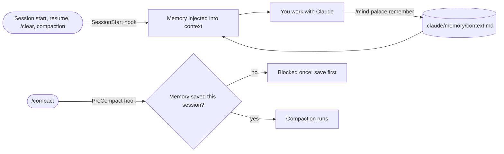

<p align="center">
  
</p>

<h3 align="center">Every new Claude Code session starts without yesterday's conversation.<br>mind-palace hands it your project's memory before you type a word.</h3>

<p align="center">
  <a href="#install"></a>
  <a href="docs/benchmark.md"></a>
  
  <a href="LICENSE"></a>
</p>

<p align="center">
  <a href="#install">Install</a> ·
  <a href="#how-it-works">How it works</a> ·
  <a href="#commands">Commands</a> ·
  <a href="#benchmark">Benchmark</a> ·
  <a href="#faq">FAQ</a>
</p>

---

Decisions, conventions, build commands and open tasks live in one small file in your repo, `.claude/memory/context.md`. Hooks load that file into Claude's context at the start of every session and again after `/clear` and compaction. No more "as I said yesterday…". Pick up exactly where you left off.

```text
# Project memory (.claude/memory/context.md, 24 lines). Before editing it, load the mind-palace:mind-palace skill.

# Project memory
## Commands
- Tests: `uv run pytest` (warnings are errors)
## Decisions
- NO_COLOR check lives in should_strip_ansi(); explicit color=True wins
## Active tasks
- NO_COLOR: helper added, not wired in. Left: wire it in, tests in tests/test_utils/, changelog
```

<sub>↑ What Claude sees at the start of a session, without reading a single file.</sub>

## Install

```text
/plugin marketplace add Jokesflow/mind-palace
/plugin install mind-palace@mind-palace
```

Start a new session. If there's no memory yet, Claude gets a one-line hint. Save your first fact with `/mind-palace:remember`.

> Upgrading from **lean-recall**? Run `/plugin marketplace remove lean-recall`, then install as above. Your `.claude/memory/context.md` stays where it is and keeps working.

## How it works



| Hook | What it does |
| --- | --- |
| `SessionStart` (startup, resume, `/clear`, fork, after compaction) | Loads `.claude/memory/context.md` into Claude's context. Warns when the file grows past ~150 lines or 9 KB. After a compaction, asks Claude to save anything from the summary that memory is missing. With no file, prints a one-line hint pointing to the template. A symlinked memory file is never loaded. |
| `PreCompact` (manual `/compact` only) | If memory hasn't changed since the session started or was last compacted, blocks that one `/compact` and asks you to save first. Running `/compact` again goes through, including from a resumed `-p` session. |

Claude Code discards PreCompact output, so blocking once is the only way to act before compaction. Automatic compaction is never blocked; the SessionStart hook catches it right after. To turn the block off, set `MIND_PALACE_COMPACT_GATE=0`, for example under `"env"` in `.claude/settings.json`. In `-p` scripts, run `/compact` twice or set that variable.

The hooks are dependency-free POSIX `sh` and take about 30 ms. They print nothing except the output described above. Their only state is two empty marker files per session in the plugin's data directory, pruned after 7 days. On Windows they need [Git for Windows](https://gitforwindows.org/), whose `sh` runs them.

## Commands

| Command | What it does |
| --- | --- |
| `/mind-palace:remember <fact>` | Saves a fact under the right heading, merging it with existing entries instead of duplicating them. Secrets are left out. With no argument, saves the durable facts from the current session. |
| `/mind-palace:recall` | Shows the current memory file and its line count. |
| `/mind-palace:compact-memory` | Checks entries against the code, then merges, compresses and prunes stale ones to stay under ~150 lines. |

Plugin commands are namespaced, so type the full `/mind-palace:` name. The `mind-palace` skill holds the working rules: correctness first, then memory upkeep and lean token use. The session-start header points Claude to it before memory edits, and `/mind-palace:mind-palace` loads it explicitly.

## What goes into memory

| ✅ Stored | ❌ Never stored |
| --- | --- |
| Stack, project structure, build/test/run commands | Transient details from one session |
| Key decisions **and the reason** behind each | File contents |
| Code conventions and your preferences | Secrets, tokens, passwords |
| Active tasks and what's left | Personal data: names, emails, addresses |

- **Budget:** about 150 lines. Entries are merged, compressed and pruned, never appended forever. Hook output over 10,000 characters reaches Claude only as a preview, which is why the hook warns early.
- **Plain Markdown:** edit it by hand any time.
- **Permissions:** `.claude/` is a protected path, so Claude Code asks before each write to this file. Where it can't ask (`-p` in default or `acceptEdits` mode, or `dontAsk`), the write is denied. Allow rules can't pre-approve it. To stop repeat prompts, choose *Yes, and allow Claude to edit files in this project's .claude folder for this session*.
- **Sharing:** commit the file to give your whole team the same memory, or add `.claude/memory/` to `.gitignore` to keep it personal. If you commit it, review its diffs: it loads into every session like `CLAUDE.md`, and a leaked secret stays in git history (remove it and rotate the secret).

**Reset:** `rm .claude/memory/context.md`. The next session notes that no memory exists, and the next `/mind-palace:remember` recreates the file with the template's headings.

## Benchmark

This was a blind A/B test on [pallets/click](https://github.com/pallets/click): 30 headless runs, the same model in both arms, and a separate judge with hidden tests. [Full method and numbers →](docs/benchmark.md)

| | Without | With mind-palace |
| --- | --- | --- |
| **Continue yesterday's work** | 8.3 / 10 | **10 / 10** (every run better) |
| Codebase questions, bug explanation, small change | 9.5 / 10 avg | 9.5 / 10 avg (no difference) |
| Token cost | baseline | +10.6% |

Memory is not free. It sits in every session's context, so the payoff is in work that spans sessions, not in one-off questions.

## FAQ

<details>
<summary><b>How is this different from CLAUDE.md or Claude Code's auto memory?</b></summary>

`CLAUDE.md` holds instructions you write by hand. Auto memory is Claude's private notes under `~/.claude`, per user and outside the repo. mind-palace keeps a structured, budgeted memory file **inside the repo**, so you can review, edit and share it with git. It adds commands to save, show and compact that file, plus hooks that guard it around compaction.
</details>

<details>
<summary><b>Does it save tokens?</b></summary>

No. In our benchmark it cost about 10% more on average, because memory is part of every session's context. What you get for that is continuity: Claude follows decisions from earlier sessions instead of re-deriving or contradicting them.
</details>

<details>
<summary><b>Why does Claude ask for permission every time it saves memory?</b></summary>

Claude Code protects everything under `.claude/`, and no allow rule can pre-approve those writes. Pick the session-wide option in the prompt to approve once per session.
</details>

<details>
<summary><b>Can a cloned repo abuse the memory file?</b></summary>

A committed memory file is loaded like a committed `CLAUDE.md`, so read it in repos you don't trust. Symlinked memory files are never loaded, which closes the "link it to your SSH key" trick.
</details>

## License

[MIT](LICENSE) · [Privacy policy](PRIVACY.md). Made for Claude Code.
